# RISTODELI - Trabajo Final Integrador 2026

<br>

<p align="center">
  
</p>

Este proyecto consiste en el desarrollo de una aplicación móvil para la gestión integral de un restaurante, enfocada en la experiencia del usuario (clientes y empleados).

<br>

## 👥 Integrantes

* **Valverde, Cristian Jorge** (Alfa): rama `feature/dev-alfa`
* **Chavez, Alejo** (Beta): rama `feature/dev-beta`
* **Trkmic Torres, Ignacio** (Gamma): rama `/feature/dev-gamma`

<br>

## 🚀 Tareas Asignadas

<details>
<summary>Ver Tareas Asignadas</summary>

De acuerdo a los requerimientos de la cátedra, se detallan las tareas asignadas a cada integrante:

| Apellidos y Nombres | Módulos (Objetivos) | Fecha Inicio | Fecha Fin |
| :--- | :--- | :--- | :--- |
| **Valverde, Cristian Jorge** | Creación del ícono de la aplicación. | 01/04/2026 | 01/04/2026 |
| **Chavez, Alejo** | Desarrollo de la interfaz de Login. | 01/04/2026 | 03/04/2026 |
| **Chavez, Alejo** | Splash Screen animada/estática. | 07/04/2026 | 07/04/2026 |
| **Valverde, Cristian Jorge** | Configuración de Supabase (Auth, DB y Storage) | 05/04/2026 | 05/04/2026 |
| **Valverde, Cristian Jorge** | Servicio de Cámara | 05/04/2026 | 05/04/2026 |
| **Valverde, Cristian Jorge** | Toast Service y Sppiner. | 07/04/2026 | 07/04/2026 |
| **Trkmic Torres, Ignacio** | Sonidos y Vibraciones. | 08/04/2026 | 09/04/2026 |
| **Chavez, Alejo** | Accesos Rápidos en Login para Testing. | 07/04/2026 | 07/04/2026 |
| **Chavez, Alejo** | Vista del Menú del Administrador. | 07/04/2026 | 16/04/2026 |
| **Valverde, Cristian Jorge** | Formulario de Cliente y Empleado. | 07/04/2026 | 08/04/2026 |
| **Trkmic Torres, Ignacio** | Formulario y Vistas: Platos y Bebidas. | 09/04/2026 | 09/04/2026 |
| **Valverde, Cristian Jorge** | Configuración de comunicaciones: Email y Push Notifications. | 12/04/2026 | 15/04/2026 |
| **Trkmic Torres, Ignacio** | Carga de activos y datos iniciales en Supabase. | 09/04/2026 | 09/04/2026 |
| **Trkmic Torres, Ignacio** | Gestión de Mesas: Creación y Generación de QR. | 09/04/2026 | 09/04/2026 |
| **Trkmic Torres, Ignacio** | Dashboards Operativos: Cocinero, Cantinero y Metre. | 09/04/2026 | 10/04/2026 |
| **Valverde, Cristian Jorge** | Experiencia del Cliente: Menú y Estado de Cuenta. | 12/04/2026 | 12/04/2026 |
| **Valverde, Cristian Jorge** | Servicio de Notificaciones: Email Automático. | 15/04/2026 | 15/04/2026 |
| **Chavez, Alejo** | Escaneo de DNI: Lector de código para carga automática de datos. | 09/04/2026 | 09/04/2026 |
| **Trkmic Torres, Ignacio** | Dashboard: Vista del Menú del Supervisor. | 10/04/2026 | 12/04/2026 |
| **Valverde, Cristian Jorge** | Sistema de Notificaciones: Asignación de mesa. | 22/04/2026 | 22/04/2026 |
| **Valverde, Cristian Jorge** | Validación de QR de Mesa Asignada. | 16/04/2026 | 24/04/2026 |
| **Valverde, Cristian Jorge** | Plantillas de Correo: Aceptación/Rechazo. | 15/04/2026 | 15/04/2026 |
| **Valverde, Cristian Jorge** | Integración de Email Service. | 15/04/2026 | 15/04/2026 |
| **Trkmic Torres, Ignacio** | Visualización del Menú vía QR. | 17/04/2026 | 17/04/2026 |
| **Trkmic Torres, Ignacio** | Actualización Home Cocinero. | 14/04/2026 | 17/04/2026 |
| **Trkmic Torres, Ignacio** | Actualización Home Cantinero. | 15/04/2026 | 17/04/2026 |
| **Chavez, Alejo** | Registro de Cliente Anónimo. | 16/04/2026 | 16/04/2026 |
| **Chavez, Alejo** | Supabase: Nueva Tabla clientes-anonimos. | 16/04/2026 | 16/04/2026 |
| **Trkmic Torres, Ignacio** | Flujo de Entrada: Cliente Anónimo. | 17/04/2026 | 21/04/2026 |
| **Chavez, Alejo** | Gestión de Mesas para Admin/Supervisor. | 17/04/2026 | 17/04/2026|
| **Chavez, Alejo** | Botón "Consulta al Mozo" en Home. | 16/04/2026 | 23/04/2026 |
| **Chavez, Alejo** | Notificación masiva de consulta a mozos. | 22/04/2026 | 25/04/2026 |
| **Chavez, Alejo** | Componente de Chat Reutilizable. | 22/04/2026 | 23/04/2026 |
| **Chavez, Alejo** | Vista de Consultas y Chat del Mozo. | 23/04/2026 | 25/04/2026 |
| **Chavez, Alejo** | Gestión de Pedidos: Confirmar/Rechazar. | 16/05/2026 | 16/05/2026 |
| **Valverde, Cristian Jorge** | Notificación de solicitud de mesa al Metre. | 22/04/2026 | 22/04/2026 |
| **Valverde, Cristian Jorge** | Vista de Detalle de Producto y Cantidad. | 24/04/2026 | 24/04/2026 |
| **Valverde, Cristian Jorge** | Carrito de Compra e Importe Total. | 24/04/2026 | 24/04/2026 |
| **Valverde, Cristian Jorge** | Confirmación de Pedido y Aviso al Mozo. | 18/05/2026 | 18/05/2026 |
| **Trkmic Torres, Ignacio** | Lógica de acceso por QR de Mesa. | 23/04/2026 | 23/04/2026 |
| **Trkmic Torres, Ignacio** | Sistema de Flags para re-escaneo de QR. | 23/04/2026 | 23/04/2026 |
| **Trkmic Torres, Ignacio** | Visualización de Encuestas con Gráficos. | 22/04/2026 | 23/04/2026 |
| **Trkmic Torres, Ignacio** | Logica y vista del menú de productos para el cliente. | 18/05/2026 | 18/05/2026 |
| **Valverde, Cristian Jorge** | Notificación del pedido al mozo y rechazo. | 25/05/2026 | 25/05/2026 |
| **Valverde, Cristian Jorge** | Notificación del pedido derivado a los sectores cocina/bar. | 28/05/2026 | 28/05/2026 |
| **Valverde, Cristian Jorge** | Desarrollo de tres juegos simples. | 19/05/2026 | 19/05/2026 |
| **Trkmic Torres, Ignacio** | Logica y vista del listado de pedidos pendientes cocina/bar. | 17/05/2026 | 17/05/2026 |
| **Chavez, Alejo** | Generación de QR para las propinas. | 23/05/2026 | 23/05/2026 |
| **Chavez, Alejo** | Correcciones de vistas: Estado del pedido por mesa. | 25/05/2026 | 25/05/2026 |
| **Trkmic Torres, Ignacio** | Logica para que el cliente realice la encuesta. | 23/05/2026 | 23/05/2026 |
| **Trkmic Torres, Ignacio** | Logica para solicitar cuenta al mozo. | 23/05/2026 | 23/05/2026 |
| **Trkmic Torres, Ignacio** | Logica para confirmar pago y liberar mesa. | 23/05/2026 | 23/05/2026 |
| **Valverde, Cristian Jorge** | Push Notifications: solicitud de cuenta, pago realizado y confirmación de pago. | 28/05/2026 | 28/05/2026 |
| **Valverde, Cristian Jorge** | Correciones de vistas (ADMIN): alta mesa, listado de mesas y aprobaciones. | 26/05/2026 | 26/05/2026 |
| **Valverde, Cristian Jorge** | Correciones de vistas: sala de chat, vistas del cocinero y vistas del mozo. | 28/05/2026 | 28/05/2026 |


</details>

<br>

## 🚀 Roadmap de Entregas

| Funcionalidad | Perfiles | Estado | Fecha - Profe |
| :--- | :--- | :--- | :--- |
| 1. Agregar un empleado | dueño o supervisor | ✅ Corregido | 16/05/2026 - Octavio |
| 2. Agregar un nuevo plato | cocinero | ✅ Corregido | 16/05/2026 - Octavio |
| 3. Agregar una nueva bebida | cantinero | ✅ Corregido | 16/05/2026 - Octavio |
| 4. Agregar una nueva mesa | dueño o supervisor | 🚀 Listo para Demo |  |
| 5. Crear un cliente registrado | cliente o metre | ✅ Corregido | 16/05/2026 - Octavio |
| 6. Verificar ingreso del cliente registrado | dueño o supervisor | 🚀 Listo para Demo |  |
| 7. Rechazar a un cliente registrado | dueño o supervisor | 🚀 Listo para Demo |  |
| 8. Aceptar a un cliente registrado | dueño o supervisor | 🚀 Listo para Demo |  |
| 9. Ingresar al local | cliente anónimo | 🚀 Listo para Demo |  |
| 10. Asignar una mesa a un cliente registrado | metre | 🚀 Listo para Demo |  |
| 11. Ver el listado de los productos | cliente registrado o anónimo | 🚀 Listo para Demo |  |
| 12. Realizar el pedido para todos los comensales de la mesa | cliente registrado o anónimo | 🚀 Listo para Demo |  |
| 13. Rechazar el pedido, para que el usuario lo modifique | mozo | 🚀 Listo para Demo |  |
| 14. Confirmar el pedido | mozo | 🚀 Listo para Demo |  |
| 15. Acceder a los juegos | cliente registrado o anónimo | 🚀 Listo para Demo |  |
| 16. Recepción de los productos correspondientes | cocinero | 🚀 Listo para Demo |  |
| 17. Recepción de los productos correspondientes | cantinero | 🚀 Listo para Demo |  |
| 18. Realizar las tareas correspondientes | cocinero y cantinero | 🚀 Listo para Demo |  |
| 19. Entrega del pedido completo | mozo | 🚀 Listo para Demo |  |
| 20. Acceder a la encuesta de satisfacción | cliente registrado o anónimo | 🚀 Listo para Demo |  |
| 21. Solicitar cuenta al mozo | cliente registrado o anónimo | 🚀 Listo para Demo |  |
| 22. Confirmar el pago y liberar mesa | mozo | 🚀 Listo para Demo |  |

### Estados

🚀 Listo para Demo (testeado y estable) <br>
🛠️ En Pruebas (terminado, solo requiere validación) <br>
🏗️ En Desarrollo (lo que se esta haciendo actualmente) <br>
⏳ Próximo (planificado para la próxima semana) <br>

<br>

## 🎨 Ver Capturas de Pantalla

<details>
<summary>Vistas de Entrada</summary>
    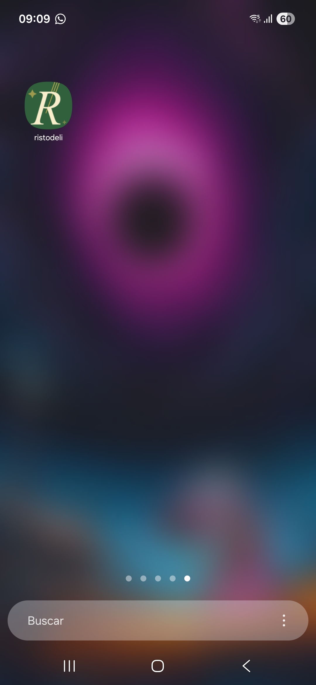
    
    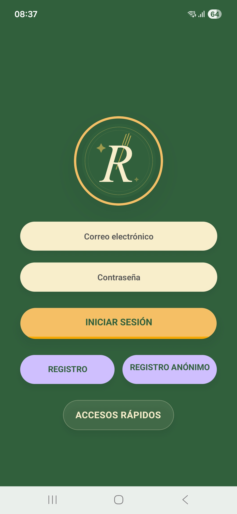
    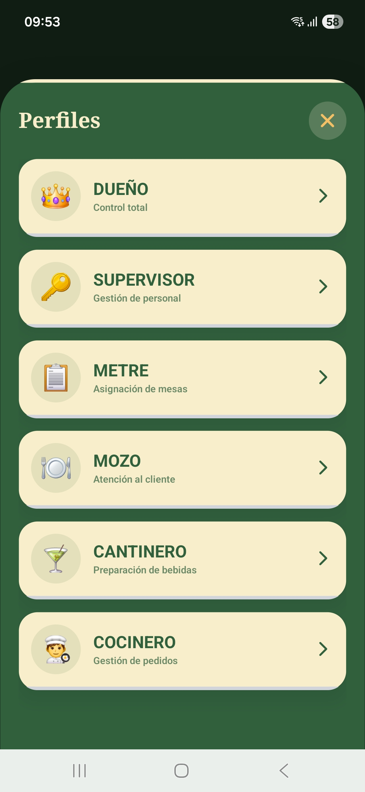
</details>

<details>
<summary>Registro: Cliente Registrado y Anonimo</summary>
    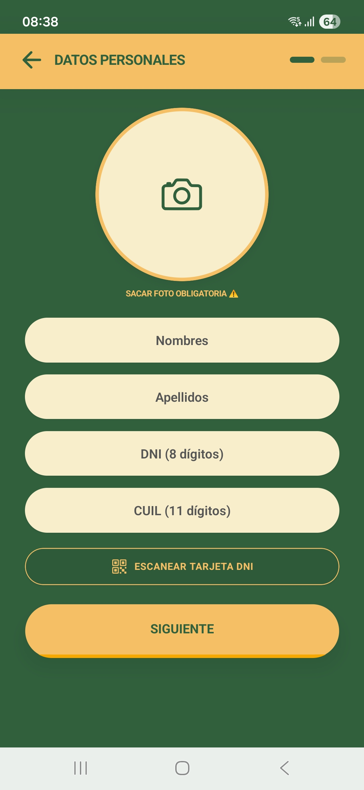
    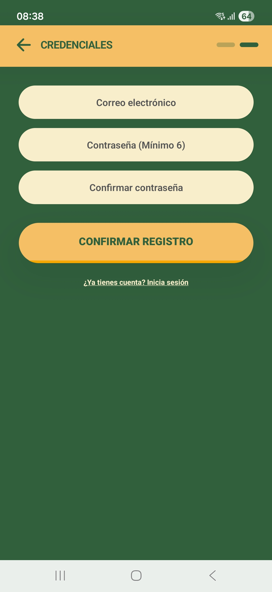
    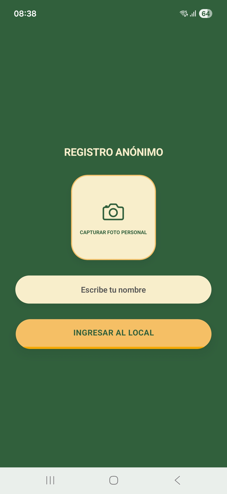
</details>

<details>
<summary>Vistas del Dueño</summary>
    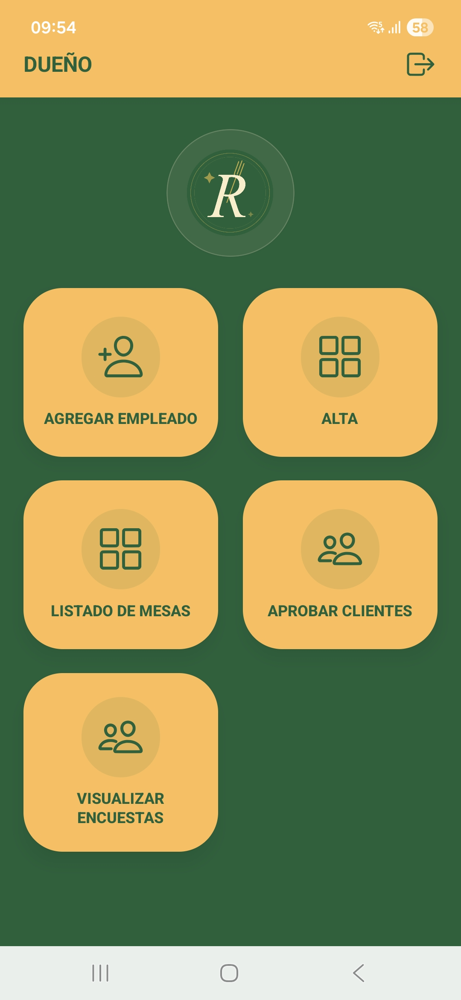
    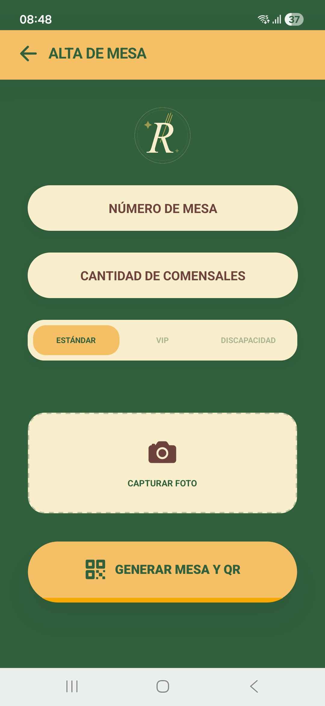
    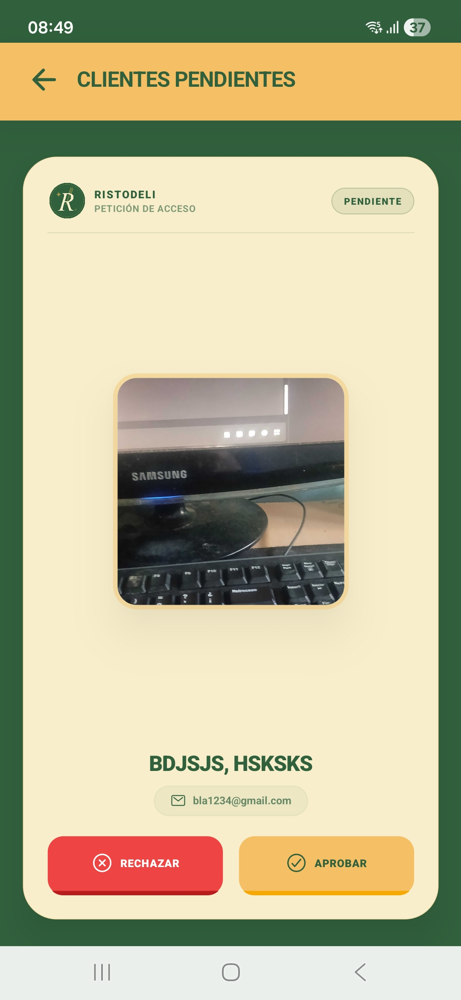
</details>

<details>
<summary>Vistas del Metre</summary>
</details>

<details>
<summary>Vistas del Mozo</summary>
</details>

<details>
<summary>Vistas del Cantinero</summary>
</details>

<details>
<summary>Vistas del Cocinero</summary>
</details>

<details>
<summary>Vistas del Cliente</summary>
</details>

<br>

## 📱 Códigos QR

<p align="center">QR de Entrada</p>

<p align="center">
  
</p>

<br>

<p align="center">QR de Mesas</p>

<p align="center">
  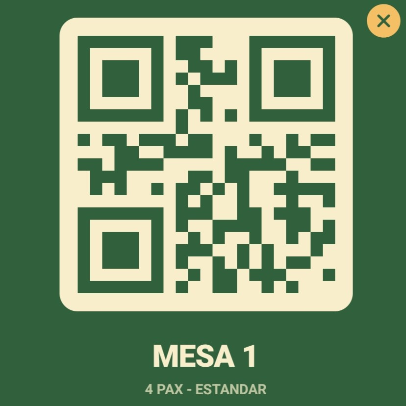
</p>
<p align="center">
  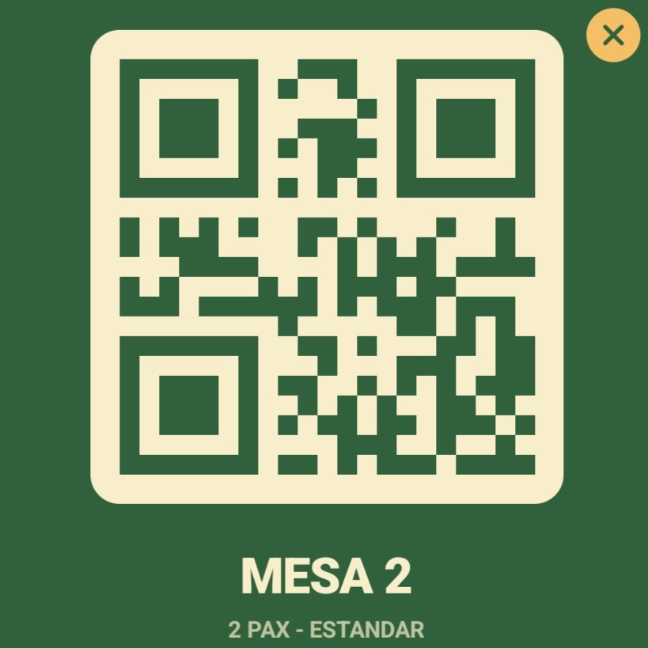
</p>
<p align="center">
  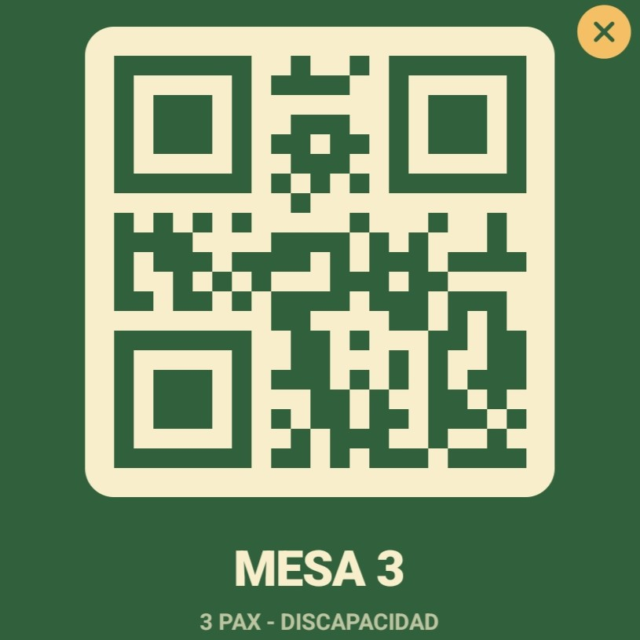
</p>
<p align="center">
  
</p>
<p align="center">
  
</p>
<p align="center">
  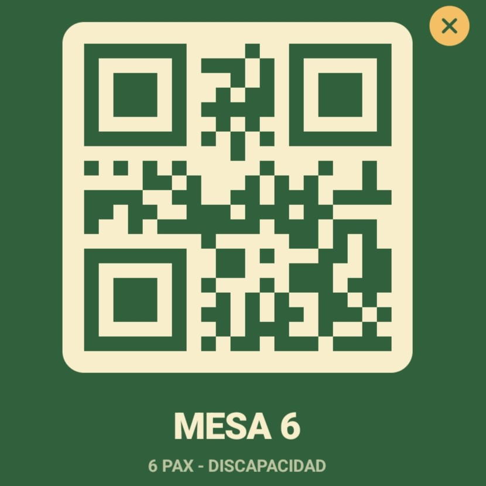
</p>

<br>

<p align="center">QR de Propinas</p>
<p align="center">
  
</p>
<p align="center">
  
</p>
<p align="center">
  
</p>
<p align="center">
  
</p>
<p align="center">
  
</p>

<br>

## 📂 Estructura del proyecto

```jsx
ristodeli/
├── app/                       # Rutas de Expo Router
│   ├── _layout.tsx            # Layout raíz (ToastProvider + SoundService de inicio)
│   ├── index.tsx              # Splash screen animado (3s → redirige a /login)
│   ├── login.tsx              # Login completo con acceso rápido por roles
│   ├── registro.tsx           # Registro de cliente con scanner DNI + foto obligatoria
│   ├── (homes)/               # Homes por rol (usan HomeBase como base compartida)
│   │   ├── duenio.tsx
│   │   ├── supervisor.tsx
│   │   ├── metre.tsx
│   │   ├── mozo.tsx
│   │   ├── cantinero.tsx
│   │   └── cocinero.tsx
│   └── (admin)/               # Pantallas de administración
│       ├── alta-mesa.tsx      # Crear mesa con foto y tipo
│       ├── listado-mesas.tsx  # Lista de mesas (datos estáticos por ahora)
│       ├── agregar-empleado.tsx
│       ├── aprobar-clientes.tsx  (vacío)
│       └── visualizar-encuestas.tsx (vacío)
├── src/
│   ├── services/
│   │   ├── SupabaseClient.ts  # Cliente Supabase (EXPO_PUBLIC_ env vars)
│   │   ├── imageService.ts    # Servicio de fotos (cámara + upload)
│   │   └── soundService.ts    # Servicio de audio (inicio, error, éxito, cierre)
│   ├── context/
│   │   └── ToastContext.tsx   # Toast personalizado + vibración haptic
│   ├── components/
│   │   └── HomeBase.tsx       # Componente base compartido para todos los homes de rol
│   ├── constants/
│   │   └── theme.ts           # Colors y Fonts (referencia, no usada activamente)
│   └── hooks/                 # use-color-scheme y use-theme-color
└── assets/
    └── sounds/
        ├── app_start.mp3
        ├── error_alert.mp3
        └── success_bip.mp3
```

<br>

## 🌿 Estrategia de Ramas (Gitflow)

Se utiliza una rama intermedia para asegurar la estabilidad antes de las entregas finales:

* **`main`**: Rama de producción para entregas de los sábados.
* **`develop`**: Rama de integración y generación de APKs de prueba.
* **`dev-alfa` / `dev-beta` / `dev-gamma`**: Ramas de desarrollo individual.

<br>

## ⚙️ Stack Tecnológico

### Framework Principal

* **React Native** `0.81` con **Expo** `~54` como plataforma de desarrollo y build.
* **Expo Router** `~6` para navegación basada en sistema de archivos (file-based routing).
* **TypeScript** `~5.9` como lenguaje principal.

### Estilos & UI

* **NativeWind** `^4` + **TailwindCSS** `^3.4` para estilos utilitarios sobre React Native.
* **@expo/vector-icons** `^15` para iconografía.
* **expo-linear-gradient** para gradientes visuales.
* **expo-image** para renderizado optimizado de imágenes.

### Navegación

* **@react-navigation/native** `^7` con **@react-navigation/bottom-tabs** `^7` para la navegación entre vistas.
* **react-native-screens** y **react-native-safe-area-context** para integración nativa.
* **react-native-gesture-handler** `~2.28` para gestos táctiles.

### Backend & Infraestructura (BaaS): Supabase

Integrado vía `@supabase/supabase-js ^2` para la gestión de:
- **Autenticación**: Manejo seguro de sesiones y perfiles de usuario (`expo-auth-session`).
- **Base de Datos**: PostgreSQL para la persistencia de la lógica de negocio (usuarios, pedidos, mesas).
- **Storage**: Gestión de archivos multimedia (avatares y fotos de productos) mediante Buckets.
- **Notificaciones Push**: `expo-notifications` para notificaciones en tiempo real.
- **Email Transaccional**: Brevo (anteriormente Sendinblue) vía API para envío de correos automáticos (aceptación/rechazo de clientes).

### Hardware & Capacidades Nativas (Expo SDK)

| Módulo | Versión | Uso |
| :--- | :--- | :--- |
| `expo-camera` | `~17` | Captura de fotos en registros |
| `expo-image-picker` | `~17` | Selección de imágenes desde galería |
| `expo-media-library` | `~18` | Acceso a la biblioteca de medios |
| `expo-haptics` | `~15` | Feedback háptico (vibraciones) |
| `expo-file-system` | `~19` | Gestión de archivos locales |
| `expo-av` | `~16` | Reproducción de audio y video |
| `expo-sensors` | `~15` | Acceso a sensores del dispositivo |

### Utilidades Específicas

* **react-native-qrcode-svg** `^6` — Generación dinámica de códigos QR para mesas.
* **react-native-maps** `1.20` — Mapas y geolocalización.
* **react-native-gifted-chat** `^3` — Componente de chat reutilizable.
* **react-native-gifted-charts** `^1.4` — Gráficos para dashboards y encuestas.
* **react-native-reanimated** `~4` — Animaciones fluidas de alto rendimiento.
* **react-native-svg** `15` — Soporte de gráficos vectoriales.
* **@react-native-async-storage/async-storage** `2.2` — Persistencia de datos local.
* **expo-sharing** y **expo-print** — Compartir y generar documentos PDF.

### Build & Distribución

* **Expo Dev Client** `~6` para builds de desarrollo con módulos nativos personalizados.
* **EAS Build** para generación de APKs de desarrollo y producción (Android).
